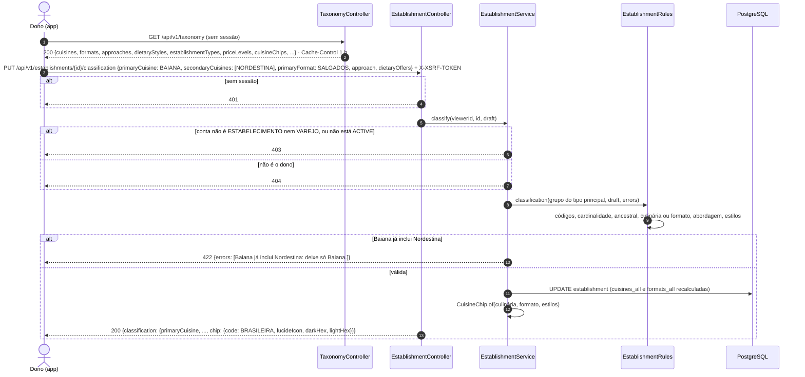

# RF7 · Sequência

```mermaid
sequenceDiagram
    autonumber
    actor D as Dono (app)
    participant TC as TaxonomyController
    participant API as EstablishmentController
    participant S as EstablishmentService
    participant R as EstablishmentRules
    participant DB as PostgreSQL

    D->>TC: GET /api/v1/taxonomy (sem sessão)
    TC-->>D: 200 {cuisines, formats, approaches, dietaryStyles, establishmentTypes, priceLevels, cuisineChips, ...} · Cache-Control 1 h
    D->>API: PUT /api/v1/establishments/{id}/classification {primaryCuisine: BAIANA, secondaryCuisines: [NORDESTINA], primaryFormat: SALGADOS, approach, dietaryOffers} + X-XSRF-TOKEN
    alt sem sessão
        API-->>D: 401
    end
    API->>S: classify(viewerId, id, draft)
    alt conta não é ESTABELECIMENTO nem VAREJO, ou não está ACTIVE
        S-->>D: 403
    else não é o dono
        S-->>D: 404
    end
    S->>R: classification(grupo do tipo principal, draft, errors)
    R->>R: códigos, cardinalidade, ancestral, culinária ou formato, abordagem, estilos
    alt Baiana já inclui Nordestina
        S-->>D: 422 {errors: [Baiana já inclui Nordestina: deixe só Baiana.]}
    else válida
        S->>DB: UPDATE establishment (cuisines_all e formats_all recalculadas)
        S->>S: CuisineChip.of(culinária, formato, estilos)
        API-->>D: 200 {classification: {primaryCuisine, ..., chip: {code: BRASILEIRA, lucideIcon, darkHex, lightHex}}}
    end
```
