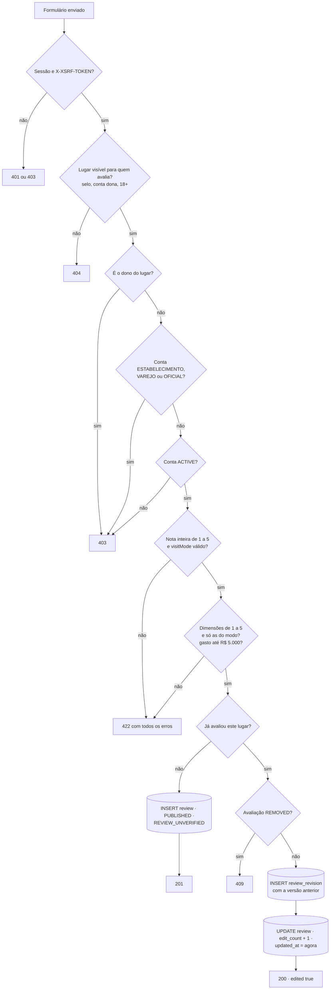
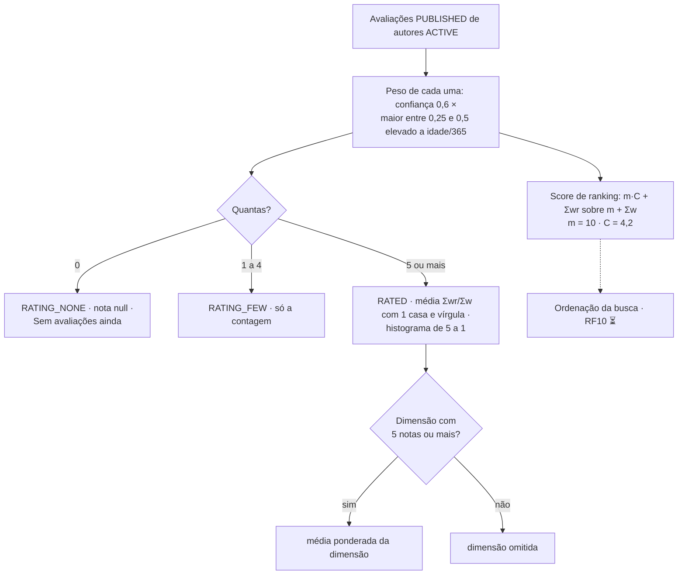

# RF8 · Atividades

## Avaliar (`PUT /api/v1/establishments/{id}/reviews/me`)

```mermaid
flowchart TD
    A[Formulário enviado] --> S{Sessão e X-XSRF-TOKEN?}
    S -- não --> E401[401 ou 403]
    S -- sim --> V{Lugar visível para quem avalia?<br/>selo, conta dona, 18+}
    V -- não --> E404[404]
    V -- sim --> D{É o dono do lugar?}
    D -- sim --> E403[403]
    D -- não --> O{Conta ESTABELECIMENTO,<br/>VAREJO ou OFICIAL?}
    O -- sim --> E403
    O -- não --> AT{Conta ACTIVE?}
    AT -- não --> E403
    AT -- sim --> N{Nota inteira de 1 a 5<br/>e visitMode válido?}
    N -- não --> E422[422 com todos os erros]
    N -- sim --> DI{Dimensões de 1 a 5<br/>e só as do modo?<br/>gasto até R$ 5.000?}
    DI -- não --> E422
    DI -- sim --> EX{Já avaliou este lugar?}
    EX -- não --> NEW[(INSERT review · PUBLISHED ·<br/>REVIEW_UNVERIFIED)] --> R201[201]
    EX -- sim --> RM{Avaliação REMOVED?}
    RM -- sim --> E409[409]
    RM -- não --> REV[(INSERT review_revision<br/>com a versão anterior)]
    REV --> UPD[(UPDATE review · edit_count + 1 ·<br/>updated_at = agora)] --> R200[200 · edited true]
```

## Calcular a nota agregada (`RatingCalculator.summarize`)

```mermaid
flowchart TD
    L[Avaliações PUBLISHED de autores ACTIVE] --> W[Peso de cada uma: confiança 0,6 ×<br/>maior entre 0,25 e 0,5 elevado a idade/365]
    W --> RK[Score de ranking: m·C + Σwr sobre m + Σw<br/>m = 10 · C = 4,2]
    W --> N{Quantas?}
    N -- 0 --> NONE[RATING_NONE · nota null ·<br/>Sem avaliações ainda]
    N -- "1 a 4" --> FEW[RATING_FEW · só a contagem]
    N -- "5 ou mais" --> RATED[RATED · média Σwr/Σw com 1 casa e vírgula ·<br/>histograma de 5 a 1]
    RATED --> DIM{Dimensão com<br/>5 notas ou mais?}
    DIM -- sim --> DM[média ponderada da dimensão]
    DIM -- não --> DX[dimensão omitida]
    RK -.-> BUSCA[Ordenação da busca · RF10 ⏳]
```
