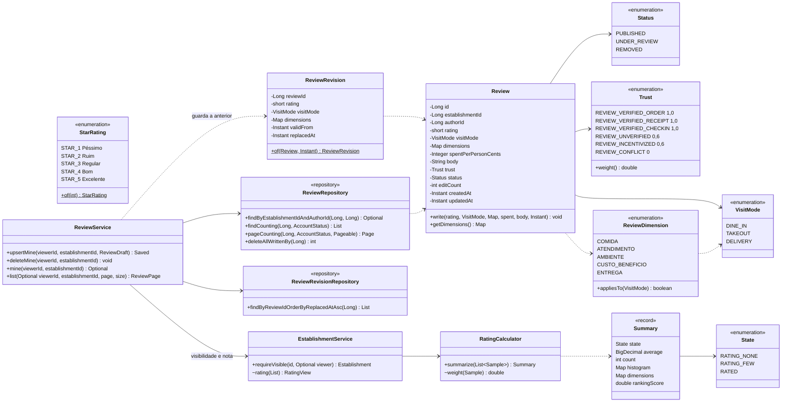

# RF8 · Classes

```mermaid
classDiagram
    direction LR
    class Review {
        -Long id
        -Long establishmentId
        -Long authorId
        -short rating
        -VisitMode visitMode
        -Map dimensions
        -Integer spentPerPersonCents
        -String body
        -Trust trust
        -Status status
        -int editCount
        -Instant createdAt
        -Instant updatedAt
        +write(rating, VisitMode, Map, spent, body, Instant) void
        +getDimensions() Map
    }
    class Status {
        <<enumeration>>
        PUBLISHED
        UNDER_REVIEW
        REMOVED
    }
    class Trust {
        <<enumeration>>
        REVIEW_VERIFIED_ORDER 1,0
        REVIEW_VERIFIED_RECEIPT 1,0
        REVIEW_VERIFIED_CHECKIN 1,0
        REVIEW_UNVERIFIED 0,6
        REVIEW_INCENTIVIZED 0,6
        REVIEW_CONFLICT 0
        +weight() double
    }
    class ReviewRevision {
        -Long reviewId
        -short rating
        -VisitMode visitMode
        -Map dimensions
        -Instant validFrom
        -Instant replacedAt
        +of(Review, Instant)$ ReviewRevision
    }
    class StarRating {
        <<enumeration>>
        STAR_1 Péssimo
        STAR_2 Ruim
        STAR_3 Regular
        STAR_4 Bom
        STAR_5 Excelente
        +of(int)$ StarRating
    }
    class VisitMode {
        <<enumeration>>
        DINE_IN
        TAKEOUT
        DELIVERY
    }
    class ReviewDimension {
        <<enumeration>>
        COMIDA
        ATENDIMENTO
        AMBIENTE
        CUSTO_BENEFICIO
        ENTREGA
        +appliesTo(VisitMode) boolean
    }
    class ReviewService {
        +upsertMine(viewerId, establishmentId, ReviewDraft) Saved
        +deleteMine(viewerId, establishmentId) void
        +mine(viewerId, establishmentId) Optional
        +list(Optional viewerId, establishmentId, page, size) ReviewPage
    }
    class RatingCalculator {
        +summarize(List~Sample~) Summary
        ~weight(Sample) double
    }
    class State {
        <<enumeration>>
        RATING_NONE
        RATING_FEW
        RATED
    }
    class Summary {
        <<record>>
        State state
        BigDecimal average
        int count
        Map histogram
        Map dimensions
        double rankingScore
    }
    class ReviewRepository {
        <<repository>>
        +findByEstablishmentIdAndAuthorId(Long, Long) Optional
        +findCounting(Long, AccountStatus) List
        +pageCounting(Long, AccountStatus, Pageable) Page
        +deleteAllWrittenBy(Long) int
    }
    class ReviewRevisionRepository {
        <<repository>>
        +findByReviewIdOrderByReplacedAtAsc(Long) List
    }
    class EstablishmentService {
        +requireVisible(id, Optional viewer) Establishment
        ~rating(List) RatingView
    }
    ReviewService --> ReviewRepository
    ReviewService --> ReviewRevisionRepository
    ReviewService --> EstablishmentService : visibilidade e nota
    ReviewService ..> ReviewRevision : guarda a anterior
    EstablishmentService --> RatingCalculator
    RatingCalculator ..> Summary
    Summary --> State
    Review --> Status
    Review --> Trust
    Review --> VisitMode
    Review ..> ReviewDimension
    ReviewDimension ..> VisitMode
    ReviewRevision ..> Review
    ReviewRepository ..> Review
```

`EstablishmentService` e `EstablishmentRules.review` (validação da nota, do modo e das dimensões) pertencem ao
[RF6](../RF6/README.md).
