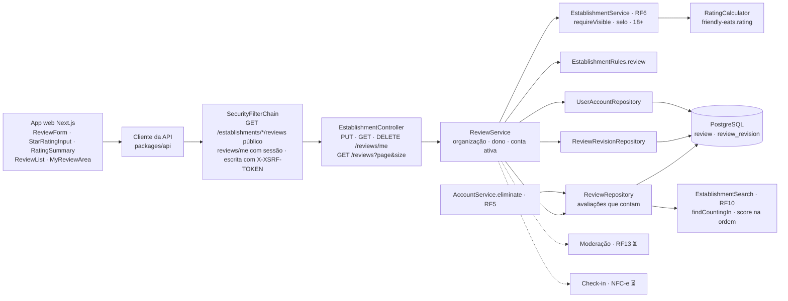

# RF8 · Componentes

```mermaid
flowchart LR
    WEB["App web Next.js<br/>ReviewForm · StarRatingInput · RatingSummary<br/>ReviewList · MyReviewArea"] --> APP["Cliente da API<br/>packages/api"] --> SEC["SecurityFilterChain<br/>GET /establishments/*/reviews público<br/>reviews/me com sessão · escrita com X-XSRF-TOKEN"]
    SEC --> EC["EstablishmentController<br/>PUT · GET · DELETE /reviews/me<br/>GET /reviews?page&size"]
    EC --> RS["ReviewService<br/>organização · dono · conta ativa"]
    RS --> ES["EstablishmentService · RF6<br/>requireVisible · selo · 18+"]
    RS --> RU["EstablishmentRules.review"]
    RS --> RR["ReviewRepository<br/>avaliações que contam"]
    RS --> RV["ReviewRevisionRepository"]
    RS --> UR["UserAccountRepository"]
    ES --> RC["RatingCalculator<br/>friendly-eats.rating"]
    RR & RV & UR --> PG[("PostgreSQL<br/>review · review_revision")]
    AS["AccountService.eliminate · RF5"] --> RR
    RR --> BUSCA["EstablishmentSearch · RF10<br/>findCountingIn · score na ordem"]
    RS -.-> MOD["Moderação · RF13 ⏳"]
    RS -.-> VER["Check-in · NFC-e ⏳"]
```
