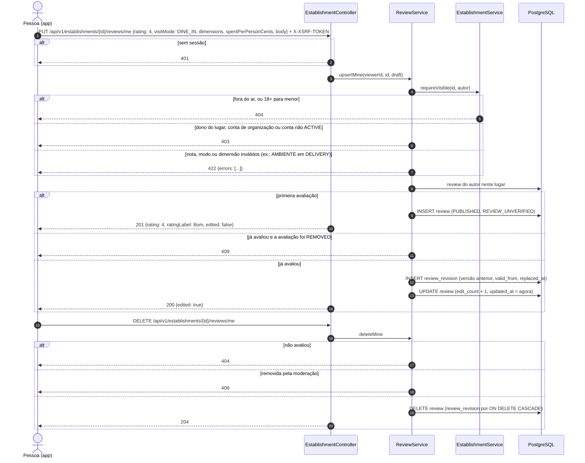
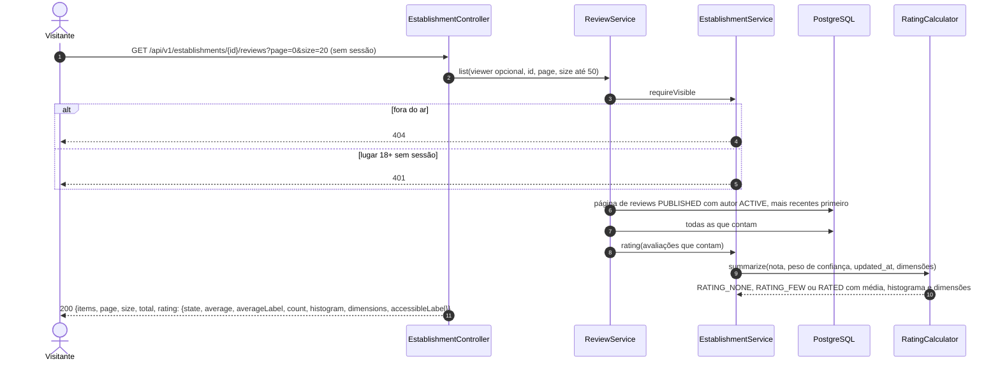

# RF8 · Sequência

## Avaliar, editar e apagar

```mermaid
sequenceDiagram
    autonumber
    actor P as Pessoa (app)
    participant API as EstablishmentController
    participant RS as ReviewService
    participant ES as EstablishmentService
    participant DB as PostgreSQL

    P->>API: PUT /api/v1/establishments/{id}/reviews/me {rating: 4, visitMode: DINE_IN, dimensions, spentPerPersonCents, body} + X-XSRF-TOKEN
    alt sem sessão
        API-->>P: 401
    end
    API->>RS: upsertMine(viewerId, id, draft)
    RS->>ES: requireVisible(id, autor)
    alt fora do ar, ou 18+ para menor
        ES-->>P: 404
    else dono do lugar, conta de organização ou conta não ACTIVE
        RS-->>P: 403
    else nota, modo ou dimensão inválidos (ex.: AMBIENTE em DELIVERY)
        RS-->>P: 422 {errors: [...]}
    end
    RS->>DB: review do autor neste lugar
    alt primeira avaliação
        RS->>DB: INSERT review (PUBLISHED, REVIEW_UNVERIFIED)
        API-->>P: 201 {rating: 4, ratingLabel: Bom, edited: false}
    else já avaliou e a avaliação foi REMOVED
        RS-->>P: 409
    else já avaliou
        RS->>DB: INSERT review_revision (versão anterior, valid_from, replaced_at)
        RS->>DB: UPDATE review (edit_count + 1, updated_at = agora)
        API-->>P: 200 {edited: true}
    end
    P->>API: DELETE /api/v1/establishments/{id}/reviews/me
    API->>RS: deleteMine
    alt não avaliou
        RS-->>P: 404
    else removida pela moderação
        RS-->>P: 409
    else
        RS->>DB: DELETE review (review_revision por ON DELETE CASCADE)
        API-->>P: 204
    end
```

## Ler a lista e a nota

```mermaid
sequenceDiagram
    autonumber
    actor V as Visitante
    participant API as EstablishmentController
    participant RS as ReviewService
    participant ES as EstablishmentService
    participant DB as PostgreSQL
    participant RC as RatingCalculator

    V->>API: GET /api/v1/establishments/{id}/reviews?page=0&size=20 (sem sessão)
    API->>RS: list(viewer opcional, id, page, size até 50)
    RS->>ES: requireVisible
    alt fora do ar
        ES-->>V: 404
    else lugar 18+ sem sessão
        ES-->>V: 401
    end
    RS->>DB: página de reviews PUBLISHED com autor ACTIVE, mais recentes primeiro
    RS->>DB: todas as que contam
    RS->>ES: rating(avaliações que contam)
    ES->>RC: summarize(nota, peso de confiança, updated_at, dimensões)
    RC-->>ES: RATING_NONE, RATING_FEW ou RATED com média, histograma e dimensões
    API-->>V: 200 {items, page, size, total, rating: {state, average, averageLabel, count, histogram, dimensions, accessibleLabel}}
```
