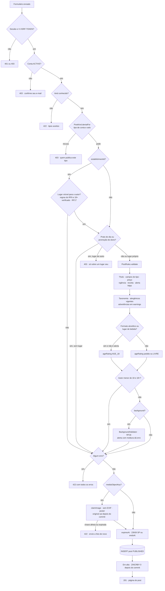
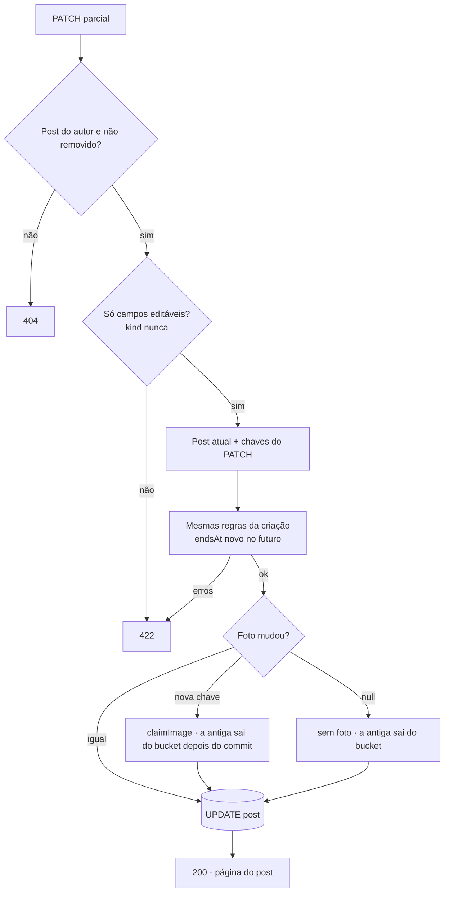

# RF9 · Atividades

## Publicar (`POST /api/v1/posts`)

```mermaid
flowchart TD
    A[Formulário enviado] --> S{Sessão e X-XSRF-TOKEN?}
    S -- não --> E401[401 ou 403]
    S -- sim --> AT{Conta ACTIVE?}
    AT -- não --> E403A[403 · confirme seu e-mail]
    AT -- sim --> K{kind conhecido?}
    K -- não --> E422K[422 · tipos aceitos]
    K -- sim --> D{PostKind.denialFor<br/>tipo de conta e selo}
    D -- recusa --> E403[403 · quem publica este tipo]
    D -- pode --> L{establishmentId?}
    L -- sim --> V{Lugar visível para o autor?<br/>regras do RF6 e 18+ verificado · RF17}
    V -- não --> ERR
    V -- sim --> O
    L -- não --> O{Prato do dia ou<br/>promoção do dono?}
    O -- sim, sem lugar --> ERR
    O -- sim, lugar de outro --> E403P[403 · só sobre um lugar seu]
    O -- não ou lugar próprio --> R[PostRules.validate]
    R --> R1[Título · campos do tipo · preço<br/>vigência · receita · alerta https]
    R1 --> R2[Taxonomia · alergênicos vigentes<br/>advertências em warnings]
    R2 --> R3{Formato alcoólico ou<br/>lugar de bebida?}
    R3 -- sim e não é alerta --> R18[ageRating AGE_18]
    R3 -- não --> RL[ageRating pedido ou LIVRE]
    R18 & RL --> MIN{Autor menor de 18 e 18+?}
    MIN -- sim --> ERR
    MIN -- não --> BG{background?}
    BG -- sim --> BV[BackgroundValidator · RF16<br/>alerta com moldura dá erro]
    BG -- não --> ERR
    BV --> ERR{Algum erro?}
    ERR -- sim --> E422[422 com todos os erros]
    ERR -- não --> F{mediaObjectKey?}
    F -- sim --> CL[claimImage · sem EXIF · posts/<br/>original sai depois do commit]
    CL -- chave alheia ou expirada --> E422F[422 · envie a foto de novo]
    F -- não --> X
    CL --> X[expiresAt · 23h59 SP ou endsAt]
    X --> DB[(INSERT post PUBLISHED)]
    DB --> T[Em alta · ZINCRBY 0 depois do commit]
    T --> OK[201 · página do post]
```

## Editar (`PATCH /api/v1/posts/{id}`)

```mermaid
flowchart TD
    P[PATCH parcial] --> OWN{Post do autor e não removido?}
    OWN -- não --> N404[404]
    OWN -- sim --> KEYS{Só campos editáveis?<br/>kind nunca}
    KEYS -- não --> E422[422]
    KEYS -- sim --> M[Post atual + chaves do PATCH]
    M --> RULES[Mesmas regras da criação<br/>endsAt novo no futuro]
    RULES -- erros --> E422
    RULES -- ok --> PH{Foto mudou?}
    PH -- nova chave --> NEW[claimImage · a antiga sai do bucket depois do commit]
    PH -- null --> DEL[sem foto · a antiga sai do bucket]
    PH -- igual --> SAVE
    NEW & DEL --> SAVE[(UPDATE post)]
    SAVE --> OK[200 · página do post]
```
