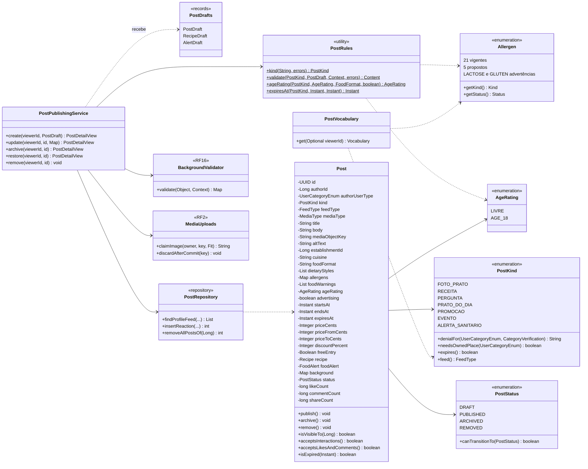

# RF9 · Classes

```mermaid
classDiagram
    direction LR
    class Post {
        -UUID id
        -Long authorId
        -UserCategoryEnum authorUserType
        -PostKind kind
        -FeedType feedType
        -MediaType mediaType
        -String title
        -String body
        -String mediaObjectKey
        -String altText
        -Long establishmentId
        -String cuisine
        -String foodFormat
        -List dietaryStyles
        -Map allergens
        -List foodWarnings
        -AgeRating ageRating
        -boolean advertising
        -Instant startsAt
        -Instant endsAt
        -Instant expiresAt
        -Integer priceCents
        -Integer priceFromCents
        -Integer priceToCents
        -Integer discountPercent
        -Boolean freeEntry
        -Recipe recipe
        -FoodAlert foodAlert
        -Map background
        -PostStatus status
        -long likeCount
        -long commentCount
        -long shareCount
        +publish() void
        +archive() void
        +remove() void
        +isVisibleTo(Long) boolean
        +acceptsInteractions() boolean
        +acceptsLikesAndComments() boolean
        +isExpired(Instant) boolean
    }
    class PostKind {
        <<enumeration>>
        FOTO_PRATO
        RECEITA
        PERGUNTA
        PRATO_DO_DIA
        PROMOCAO
        EVENTO
        ALERTA_SANITARIO
        +denialFor(UserCategoryEnum, CategoryVerification) String
        +needsOwnedPlace(UserCategoryEnum) boolean
        +expires() boolean
        +feed() FeedType
    }
    class PostStatus {
        <<enumeration>>
        DRAFT
        PUBLISHED
        ARCHIVED
        REMOVED
        +canTransitionTo(PostStatus) boolean
    }
    class AgeRating {
        <<enumeration>>
        LIVRE
        AGE_18
    }
    class Allergen {
        <<enumeration>>
        21 vigentes
        5 propostos
        LACTOSE e GLUTEN advertências
        +getKind() Kind
        +getStatus() Status
    }
    class PostRules {
        <<utility>>
        +kind(String, errors)$ PostKind
        +validate(PostKind, PostDraft, Context, errors)$ Content
        +ageRating(PostKind, AgeRating, FoodFormat, boolean)$ AgeRating
        +expiresAt(PostKind, Instant, Instant)$ Instant
    }
    class PostDrafts {
        <<records>>
        PostDraft
        RecipeDraft
        AlertDraft
    }
    class PostPublishingService {
        +create(viewerId, PostDraft) PostDetailView
        +update(viewerId, id, Map) PostDetailView
        +archive(viewerId, id) PostDetailView
        +restore(viewerId, id) PostDetailView
        +remove(viewerId, id) void
    }
    class PostVocabulary {
        +get(Optional viewerId) Vocabulary
    }
    class PostRepository {
        <<repository>>
        +findProfileFeed(...) List
        +insertReaction(...) int
        +removeAllPostsOf(Long) int
    }
    class BackgroundValidator {
        <<RF16>>
        +validate(Object, Context) Map
    }
    class MediaUploads {
        <<RF2>>
        +claimImage(owner, key, Fit) String
        +discardAfterCommit(key) void
    }
    PostPublishingService --> PostRules
    PostPublishingService --> PostRepository
    PostPublishingService --> MediaUploads
    PostPublishingService --> BackgroundValidator
    PostPublishingService ..> PostDrafts : recebe
    PostRules ..> Allergen
    PostRules ..> AgeRating
    PostRepository ..> Post
    Post --> PostKind
    Post --> PostStatus
    Post --> AgeRating
    PostVocabulary ..> PostKind
    PostVocabulary ..> Allergen
```

A página do post que o serviço devolve (`PostViews.PostDetailView`) e o `PostReader` estão no [RF14](../RF14/classes.md);
as interações, no [RF12](../RF12/classes.md).
