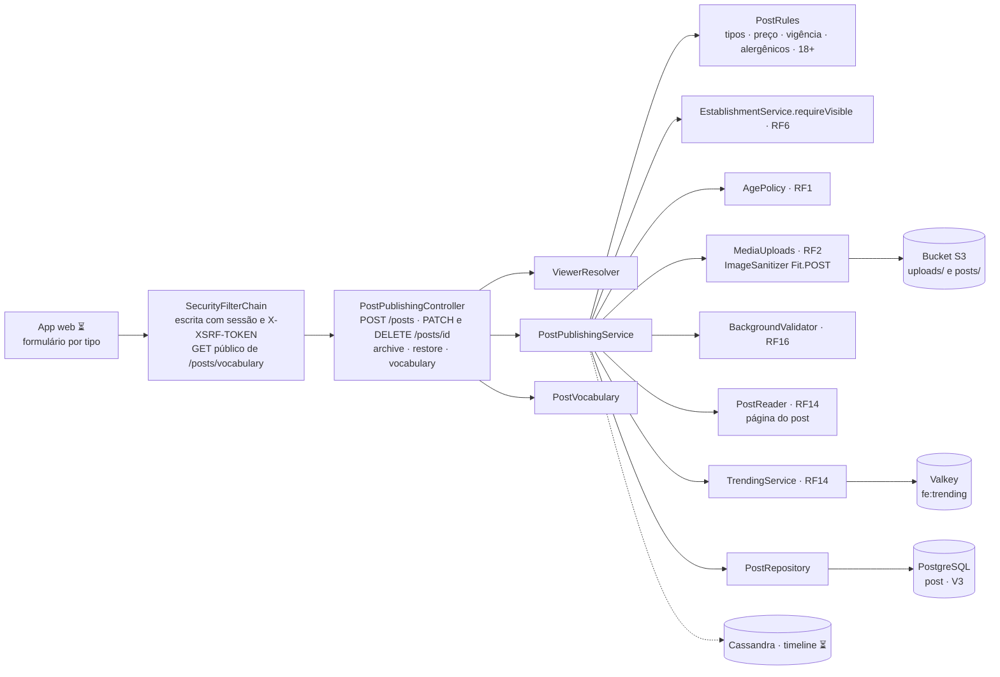

# RF9 · Componentes

```mermaid
flowchart LR
    APP["App web ⏳<br/>formulário por tipo"] --> SEC["SecurityFilterChain<br/>escrita com sessão e X-XSRF-TOKEN<br/>GET público de /posts/vocabulary"]
    SEC --> PC["PostPublishingController<br/>POST /posts · PATCH e DELETE /posts/id<br/>archive · restore · vocabulary"]
    PC --> VR["ViewerResolver"]
    PC --> PS["PostPublishingService"]
    PC --> PV["PostVocabulary"]
    PS --> RU["PostRules<br/>tipos · preço · vigência · alergênicos · 18+"]
    PS --> ES["EstablishmentService.requireVisible · RF6"]
    PS --> AP["AgePolicy · RF1"]
    PS --> MU["MediaUploads · RF2<br/>ImageSanitizer Fit.POST"]
    PS --> BV["BackgroundValidator · RF16"]
    PS --> RD["PostReader · RF14<br/>página do post"]
    PS --> TS["TrendingService · RF14"]
    PS --> PR["PostRepository"]
    PR --> PG[("PostgreSQL<br/>post · V3")]
    MU --> S3[("Bucket S3<br/>uploads/ e posts/")]
    TS --> VK[("Valkey<br/>fe:trending")]
    PS -.-> CS[("Cassandra · timeline ⏳")]
```
