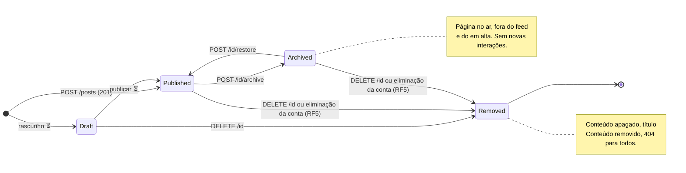
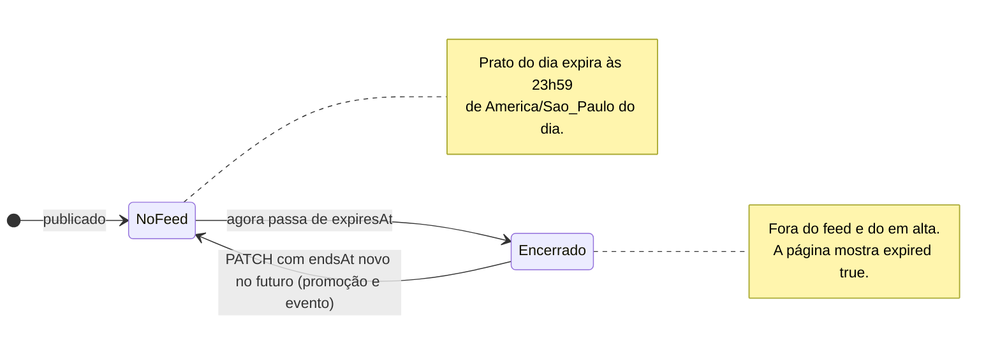
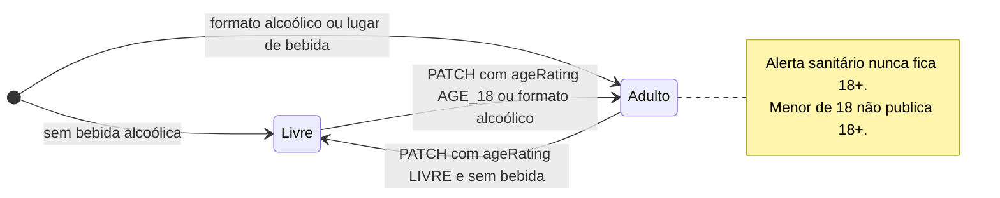

# RF9 · Estados

## Ciclo de vida do post (`post.status`)

```mermaid
stateDiagram-v2
    direction LR
    [*] --> Published : POST /posts (201)
    [*] --> Draft : rascunho ⏳
    Draft --> Published : publicar ⏳
    Published --> Archived : POST /id/archive
    Archived --> Published : POST /id/restore
    Draft --> Removed : DELETE /id
    Published --> Removed : DELETE /id ou eliminação da conta (RF5)
    Archived --> Removed : DELETE /id ou eliminação da conta (RF5)
    Removed --> [*]
    note right of Archived
        Página no ar, fora do feed
        e do em alta. Sem novas interações.
    end note
    note right of Removed
        Conteúdo apagado, título
        Conteúdo removido, 404 para todos.
    end note
```

## Vigência (prato do dia, promoção e evento)

```mermaid
stateDiagram-v2
    direction LR
    [*] --> NoFeed : publicado
    NoFeed --> Encerrado : agora passa de expiresAt
    Encerrado --> NoFeed : PATCH com endsAt novo no futuro (promoção e evento)
    note right of NoFeed
        Prato do dia expira às 23h59
        de America/Sao_Paulo do dia.
    end note
    note right of Encerrado
        Fora do feed e do em alta.
        A página mostra expired true.
    end note
```

## Classificação etária

```mermaid
stateDiagram-v2
    direction LR
    [*] --> Livre : sem bebida alcoólica
    [*] --> Adulto : formato alcoólico ou lugar de bebida
    Livre --> Adulto : PATCH com ageRating AGE_18 ou formato alcoólico
    Adulto --> Livre : PATCH com ageRating LIVRE e sem bebida
    note right of Adulto
        Alerta sanitário nunca fica 18+.
        Menor de 18 não publica 18+.
    end note
```
