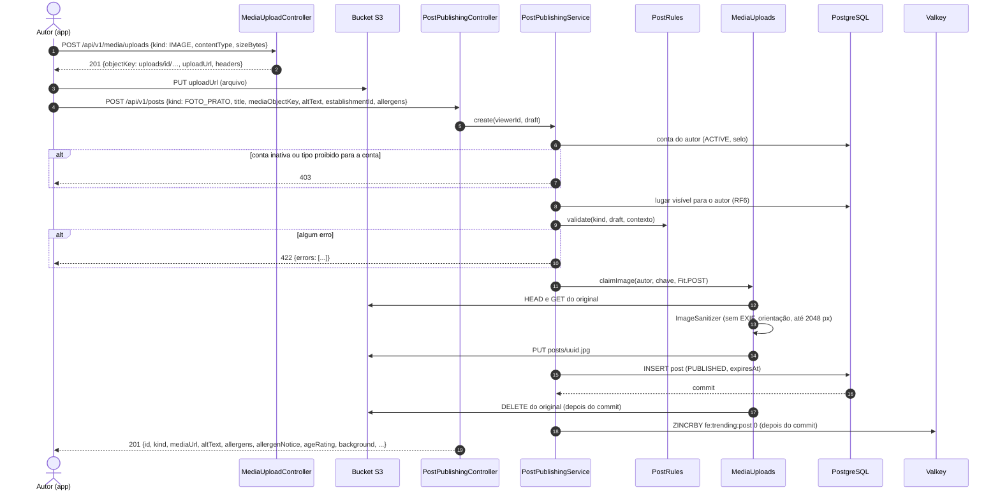
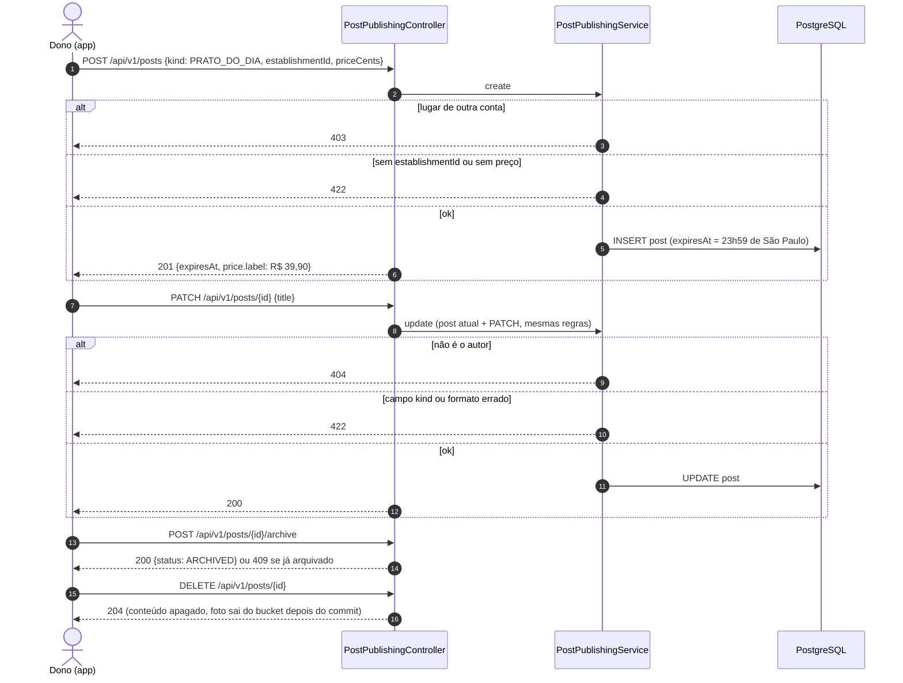

# RF9 · Sequência

## Publicar uma foto de prato

```mermaid
sequenceDiagram
    autonumber
    actor A as Autor (app)
    participant M as MediaUploadController
    participant B as Bucket S3
    participant API as PostPublishingController
    participant S as PostPublishingService
    participant R as PostRules
    participant MU as MediaUploads
    participant DB as PostgreSQL
    participant V as Valkey

    A->>M: POST /api/v1/media/uploads {kind: IMAGE, contentType, sizeBytes}
    M-->>A: 201 {objectKey: uploads/id/…, uploadUrl, headers}
    A->>B: PUT uploadUrl (arquivo)
    A->>API: POST /api/v1/posts {kind: FOTO_PRATO, title, mediaObjectKey, altText, establishmentId, allergens}
    API->>S: create(viewerId, draft)
    S->>DB: conta do autor (ACTIVE, selo)
    alt conta inativa ou tipo proibido para a conta
        S-->>A: 403
    end
    S->>DB: lugar visível para o autor (RF6)
    S->>R: validate(kind, draft, contexto)
    alt algum erro
        S-->>A: 422 {errors: [...]}
    end
    S->>MU: claimImage(autor, chave, Fit.POST)
    MU->>B: HEAD e GET do original
    MU->>MU: ImageSanitizer (sem EXIF, orientação, até 2048 px)
    MU->>B: PUT posts/uuid.jpg
    S->>DB: INSERT post (PUBLISHED, expiresAt)
    DB-->>S: commit
    MU->>B: DELETE do original (depois do commit)
    S->>V: ZINCRBY fe:trending:post 0 (depois do commit)
    API-->>A: 201 {id, kind, mediaUrl, altText, allergens, allergenNotice, ageRating, background, ...}
```

## Prato do dia e edição

```mermaid
sequenceDiagram
    autonumber
    actor D as Dono (app)
    participant API as PostPublishingController
    participant S as PostPublishingService
    participant DB as PostgreSQL

    D->>API: POST /api/v1/posts {kind: PRATO_DO_DIA, establishmentId, priceCents}
    API->>S: create
    alt lugar de outra conta
        S-->>D: 403
    else sem establishmentId ou sem preço
        S-->>D: 422
    else ok
        S->>DB: INSERT post (expiresAt = 23h59 de São Paulo)
        API-->>D: 201 {expiresAt, price.label: R$ 39,90}
    end
    D->>API: PATCH /api/v1/posts/{id} {title}
    API->>S: update (post atual + PATCH, mesmas regras)
    alt não é o autor
        S-->>D: 404
    else campo kind ou formato errado
        S-->>D: 422
    else ok
        S->>DB: UPDATE post
        API-->>D: 200
    end
    D->>API: POST /api/v1/posts/{id}/archive
    API-->>D: 200 {status: ARCHIVED} ou 409 se já arquivado
    D->>API: DELETE /api/v1/posts/{id}
    API-->>D: 204 (conteúdo apagado, foto sai do bucket depois do commit)
```
